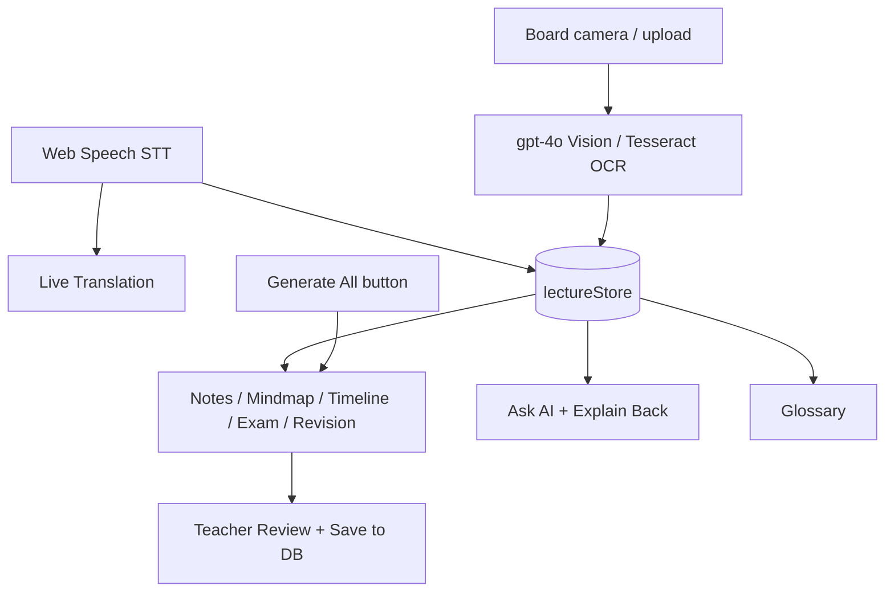

# IntelliShala — AI Features Reference

> Complete guide to every AI-integrated feature: how it works, which APIs power it, and what makes each one unique (USP). Written for demos, evaluations, and judge Q&A.

**Related:** [README](../README.md) · [Technical Documentation](./TECHNICAL_DOCUMENTATION.md) · [IBM Evaluation Q&A](./IBM_EVALUATION_QA.md) · [Live Demo](https://microphone-file-red-two.vercel.app)

---

## Table of Contents

1. [AI stack at a glance](#1-ai-stack-at-a-glance)
2. [Data flow overview](#2-data-flow-overview)
3. [Feature catalog](#3-feature-catalog)
4. [Platform-level USP](#4-platform-level-usp)
5. [What works without OpenAI](#5-what-works-without-openai)
6. [UI tab map](#6-ui-tab-map)
7. [Key source files](#7-key-source-files)
8. [Judge Q&A cheat sheet](#8-judge-qa-cheat-sheet)

---

## 1. AI stack at a glance

| Technology | Role | API key required? |
|------------|------|-------------------|
| **Web Speech API** | Live speech-to-text (STT) | No |
| **OpenAI `gpt-4o-mini`** | Notes, chat, quiz, glossary, timeline, etc. | Yes (`OPENAI_API_KEY`) |
| **OpenAI `gpt-4o`** | Board/slide vision analysis | Yes |
| **MyMemory** | Fast live translation | No |
| **Tesseract.js** | OCR fallback for board images | No |
| **Web Speech Synthesis** | Read-aloud (TTS) | No |
| **Code-only logic** | Keyword detection, terminology fixes, glossary fallback | No |

**Design principle:** Use **code** for deterministic work (timestamps, keyword flags, term preservation) and **AI** only where language understanding or generation is required. This reduces cost, latency, and hallucination risk.

---

## 2. Data flow overview

Everything AI-related flows from the **lecture transcript** stored in Zustand `lectureStore`, optionally enriched by **board captures** from the Board tab.

**Important:** Raw audio never hits the Next.js server for transcription. Only **text** (and board images) are sent to server-side API routes.

---

## 3. Feature catalog

### 3.1 Live transcription (STT)

| | |
|---|---|
| **UI** | Live Captions tab |
| **Client** | `src/hooks/useSpeechRecognition.ts` |
| **Server** | None — runs entirely in the browser |
| **External API** | Web Speech API (Chrome/Edge use Google speech servers) |

**How it works**

1. Teacher clicks **Start Lecture** → `isRecording = true`.
2. Mic is warmed up via `getUserMedia`.
3. `SpeechRecognition` runs with `continuous: true`, `interimResults: true`, and `lang` from the **Speak in** dropdown.
4. Each result calls `addSegment(text, isFinal)` in `lectureStore`.
5. Interim text shows in italics; final text is locked and eligible for translation.

**USP:** Zero server cost, zero API key, near real-time captions. Audio stays in the browser — privacy-friendly compared to uploading recordings.

---

### 3.2 Live bilingual captions (translation)

| | |
|---|---|
| **UI** | Live Captions tab (line below source text) |
| **Client** | `src/hooks/useLiveTranslation.ts` |
| **Server** | `POST /api/translate` |
| **External APIs** | MyMemory (fast path) → OpenAI `gpt-4o-mini` (quality / fallback) |
| **Post-processing** | `preserveTerminology()` in `src/lib/terminology.ts` |

**How it works**

1. Hook watches segments where `isFinal && !translatedText`.
2. Batches up to 8 lines; flushes within ~120–450 ms so translation never stalls during continuous speech.
3. Sends `texts`, `sourceLanguage`, `targetLanguage`, `learningLevel`, `preferFast: true`.
4. API tries MyMemory first when `preferFast` is set; falls back to GPT; then MyMemory again if GPT fails.
5. Results written back via `updateSegmentTranslations`.

**USP:** Real-time **classroom captions** in 9 languages — not generic page translation. Hybrid speed/quality path (MyMemory for live, GPT when needed). CS terminology preserved after machine translation.

---

### 3.3 Structured notes

| | |
|---|---|
| **UI** | Notes tab → **Generate Notes** |
| **Server** | `POST /api/generate-notes` |
| **External API** | OpenAI `gpt-4o-mini` |

**How it works**

Sends `fullTranscript` plus **board capture descriptions** (timestamped text from Board tab) to GPT. Returns markdown notes in the student's **Translate to** language.

**USP:** Notes are grounded in what was actually said **and** what was on the board — multimodal lecture capture, not a generic summary.

---

### 3.4 Simplified notes (learning level)

| | |
|---|---|
| **UI** | Notes tab → **Simplify** + toggle |
| **Server** | `POST /api/simplify-notes` |
| **External API** | OpenAI `gpt-4o-mini` |
| **Prompt tuning** | `src/lib/learning-level.ts` — beginner / standard / advanced |

**How it works**

Rewrites existing structured notes at the selected learning level. UI toggles between full and simplified versions.

**USP:** Same lecture, three difficulty levels — supports mixed classrooms without separate content prep.

---

### 3.5 Mindmap

| | |
|---|---|
| **UI** | Mindmap tab |
| **Server** | `POST /api/mindmap` |
| **Renderer** | `MindmapViewer` (Markmap) |
| **External API** | OpenAI `gpt-4o-mini` |

**How it works**

GPT outputs a hierarchical markdown outline (`#`, `##`, `###`) from transcript + notes. Markmap renders it as an interactive diagram.

**USP:** Visual topic hierarchy generated from the actual lecture — students see how concepts connect.

---

### 3.6 Timeline

| | |
|---|---|
| **UI** | Timeline tab |
| **Server** | `POST /api/timeline` |
| **External API** | OpenAI `gpt-4o-mini` |

**How it works**

GPT splits the transcript into topic segments with approximate `startTime` / `endTime`, distributed proportionally over lecture duration.

**USP:** Chapter-marker navigation for long lectures — jump to topics without scrubbing a video.

---

### 3.7 Important lines (hybrid AI + code)

| | |
|---|---|
| **UI** | Important tab |
| **Live detection** | Code — `IMPORTANT_KEYWORDS` in `lectureStore` |
| **Deep scan** | `POST /api/important-questions` → OpenAI |
| **External API** | OpenAI `gpt-4o-mini` (optional pass only) |

**How it works**

- **During recording:** If the teacher says "remember this", "exam", "important", etc., the line is flagged instantly — **zero API cost**.
- **After lecture:** Optional **AI Deep Scan** finds exam-relevant lines even without explicit cue words.

**USP:** Hybrid reliability — instant keyword flags during class, optional LLM pass for deeper analysis. Cheaper and more dependable than LLM-only approaches.

---

### 3.8 Exam / quiz questions

| | |
|---|---|
| **UI** | Quiz tab |
| **Server** | `POST /api/exam-notes` |
| **Viewer** | `QuizViewer` — self-check + score save to DB |
| **External API** | OpenAI `gpt-4o-mini` |

**How it works**

Generates 4–6 short-answer and long-answer questions with optional hints from transcript, notes, and important lines. Students mark confidence; scores persist via `POST /api/lectures/[id]/quiz`.

**USP:** Exam prep from **your own lecture** — aligned with what the teacher taught, not generic textbook questions.

---

### 3.9 Revision notes

| | |
|---|---|
| **UI** | Revision tab |
| **Server** | `POST /api/revision-notes` |
| **External API** | OpenAI `gpt-4o-mini` |

**How it works**

Compresses full structured notes into a one-page bullet summary in the target language.

**USP:** Pre-exam cram sheet auto-generated from the same session.

---

### 3.10 Explain Back (active learning)

| | |
|---|---|
| **UI** | Explain Back tab |
| **Server** | `POST /api/explain-back` |
| **External API** | OpenAI `gpt-4o-mini` |

**How it works**

1. Student selects a concept and writes their explanation.
2. GPT compares against transcript + notes.
3. Returns JSON: `score` (0–100), `correct[]`, `missed[]`, `feedback`.
4. Scoring strictness adapts to learning level (lenient for beginner, strict for advanced).

**USP:** Active retrieval practice with rubric-style feedback — not a passive chatbot. Strong evaluation differentiator.

---

### 3.11 Ask AI (lecture-grounded chat)

| | |
|---|---|
| **UI** | Ask AI tab |
| **Server** | `POST /api/chat` |
| **External API** | OpenAI `gpt-4o-mini` |

**How it works**

Student question + full transcript + notes → GPT answers **only from lecture content**. Prompt instructs the model to say clearly when the answer is not in the lecture.

**USP:** Grounded Q&A (RAG-lite without a vector database) — reduces hallucination vs generic ChatGPT. Respects learning level in tone and depth.

---

### 3.12 Board / slide analysis (vision)

| | |
|---|---|
| **UI** | Board tab (teacher only) |
| **Server** | `POST /api/analyze-board` |
| **External APIs** | OpenAI `gpt-4o` (vision) → Tesseract.js OCR fallback |
| **Client** | Camera capture or file upload in `BoardTab.tsx` |

**How it works**

1. Image captured as base64.
2. GPT-4o vision returns JSON: `description` + `latex` formulas.
3. If OpenAI fails → Tesseract OCR extracts plain text.
4. Result stored in `boardCaptures` and included when generating notes.

**USP:** Multimodal lecture capture — whiteboard diagrams and formulas become part of notes. OCR fallback keeps demos working without OpenAI credits.

---

### 3.13 Glossary (bilingual terms)

| | |
|---|---|
| **UI** | Glossary tab |
| **Server** | `POST /api/glossary` |
| **External API** | OpenAI `gpt-4o-mini` → code fallback |
| **Fallback** | `buildFallbackGlossary()` + `TERMINOLOGY` map |

**How it works**

Extracts 8–12 key terms with English definition, native-script translation, and category (term / concept / formula). If OpenAI unavailable, scans transcript for known CS terms and complexity notation.

**USP:** Bilingual glossary for multilingual classrooms. Works partially without API key.

---

### 3.14 Generate All (one-click pipeline)

| | |
|---|---|
| **UI** | Teacher header button after lecture ends |
| **Server** | `POST /api/generate-all` (`action: "generate-all"`) |
| **External API** | Six parallel OpenAI calls |

**How it works**

One request generates in parallel:

- Structured notes
- Mindmap markdown
- Timeline JSON
- Important lines JSON
- Exam questions JSON
- Revision notes

All results populate `lectureStore` tabs at once.

**USP:** End-to-end classroom workflow in one action — no clicking six separate Generate buttons.

---

### 3.15 Read aloud (TTS)

| | |
|---|---|
| **UI** | `SpeakButton` on captions, notes, glossary |
| **Client** | `src/lib/tts.ts` |
| **External API** | Web Speech Synthesis (browser voices) |

**How it works**

Uses OS-installed voices to read content in the selected language when available.

**USP:** Accessibility and language learning — hear content in Hindi, Tamil, etc. when native voices are installed. Not LLM-powered, but part of the multilingual experience.

---

### 3.16 Teacher review workflow (trust layer)

| | |
|---|---|
| **UI** | `/teacher/lectures/[id]/review` |
| **AI** | None — human-in-the-loop |

**How it works**

Saved lectures have content blocks with status: **AI Generated** → **Teacher Edited** → **Teacher Approved**. Teacher can edit text before students see final content.

**USP:** AI suggests, teacher approves — critical for institutions that won't trust raw LLM output.

---

## 4. Platform-level USP

| Typical tool | IntelliShala difference |
|--------------|-------------------------|
| Otter / Fireflies | Meeting transcribers only — IntelliShala is a **full classroom portal** (courses, enrollments, dashboards, teacher approval, quiz scores). |
| Google Translate | Translates arbitrary text — IntelliShala translates **live lecture captions** with CS terminology preservation and learning-level tuning. |
| ChatGPT | Open-ended — IntelliShala chat is **locked to the lecture transcript**. |
| Single-feature apps | IntelliShala combines **live STT + live MT + notes + mindmap + exam + explain-back + board vision** in one live session UI. |
| AI-only stacks | Hybrid **code + AI** (keywords, terminology, OCR/glossary fallbacks) so demos survive missing API keys or exhausted credits. |
| English-only tools | **9 languages**, speech locale picker, bilingual glossary, notes in target language. |

**One-line pitch:**

> IntelliShala is a multilingual classroom operating system: it captures live speech, translates captions in real time, analyzes the board, and turns one lecture into notes, mindmaps, quizzes, revision sheets, and grounded Q&A — with hybrid code+AI reliability and a teacher approval workflow.

---

## 5. What works without OpenAI

| Feature | Without `OPENAI_API_KEY` |
|---------|--------------------------|
| Live STT | Yes (Web Speech) |
| Live translation | Yes (MyMemory) |
| Important (live keyword pass) | Yes (code) |
| Glossary | Partial (code fallback) |
| Board analysis | Partial (Tesseract OCR only) |
| Notes, mindmap, chat, exam, explain-back, revision, timeline | No |
| Generate All | No |

---

## 6. UI tab map

Live session: `/session/live`

| Tab | Feature | Primary API |
|-----|---------|-------------|
| Live Captions | STT + translation | Web Speech + `/api/translate` |
| Notes | Generate + simplify | `/api/generate-notes`, `/api/simplify-notes` |
| Mindmap | Outline → diagram | `/api/mindmap` |
| Glossary | Term extraction | `/api/glossary` |
| Timeline | Topic segments | `/api/timeline` |
| Important | Keywords + AI scan | Code + `/api/important-questions` |
| Quiz | Exam questions | `/api/exam-notes` |
| Revision | One-page summary | `/api/revision-notes` |
| Explain Back | Score explanation | `/api/explain-back` |
| Ask AI | Grounded chat | `/api/chat` |
| Board | Vision + OCR | `/api/analyze-board` |

Teacher-only: **Board** tab, **Generate All** button, **Save to course** with review workflow.

---

## 7. Key source files

| Area | Files |
|------|-------|
| STT | `src/hooks/useSpeechRecognition.ts` |
| Live translation | `src/hooks/useLiveTranslation.ts`, `src/app/api/translate/route.ts`, `src/lib/translate.ts` |
| LLM core | `src/lib/llm.ts`, `src/lib/llm-service.ts` |
| Learning level prompts | `src/lib/learning-level.ts` |
| Terminology | `src/lib/terminology.ts` |
| Board / OCR | `src/app/api/analyze-board/route.ts`, `src/lib/board-analysis.ts` |
| Glossary fallback | `src/lib/glossary-fallback.ts` |
| State | `src/store/lectureStore.ts` |
| Generate All | `src/app/api/generate-all/route.ts`, `src/components/GenerateAllButton.tsx` |
| Tabs | `src/components/tabs/*.tsx` |
| TTS | `src/lib/tts.ts`, `src/components/SpeakButton.tsx` |

---

## 8. Judge Q&A cheat sheet

**Q: Where does transcription happen?**  
A: In the browser via Web Speech API. Audio never hits our Next.js server.

**Q: What API do you use for translation?**  
A: MyMemory for fast live captions; OpenAI gpt-4o-mini for quality; automatic fallback between them.

**Q: How do you prevent AI hallucination in chat?**  
A: The chat prompt restricts answers to transcript + notes only, and instructs the model to say when content isn't in the lecture.

**Q: What if OpenAI credits run out?**  
A: Live STT, live translation (MyMemory), keyword important detection, OCR board fallback, and code glossary still work. Notes and chat need OpenAI.

**Q: What's unique vs Otter or Notion AI?**  
A: Full classroom portal + multilingual live captions + hybrid code/AI + teacher approval + active learning (Explain Back) — not just transcription.

**Q: Can STT work offline?**  
A: Not with Web Speech (needs network). Offline would require local/browser Whisper — see Technical Documentation §3.7 for upgrade path.

**Q: Why hybrid code + AI for "important" lines?**  
A: Keyword detection is instant and free during live class. LLM deep scan is optional and catches implicit exam hints the teacher didn't flag verbally.

**Q: How is board content used?**  
A: Vision/OCR descriptions are stored in `boardCaptures` and injected into note generation so formulas and diagrams on the whiteboard appear in structured notes.

---

*Last updated: August 2026 — matches codebase at `src/app/api/*` and live session tabs.*
